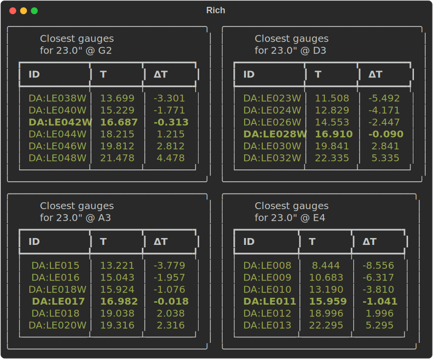

# stringcalc

_Calculations for [string instrument](https://en.wikipedia.org/wiki/String_instrument)s' strings_

[](https://pypi.org/project/stringcalc/)
[](https://github.com/zmoon/stringcalc/actions/workflows/ci.yml)
[](https://stringcalc.readthedocs.io/en/latest/)
[](https://www.repostatus.org/#wip)

```sh
stringcalc gauge --suggest -T 17 -L 23 -P G2 -P D3 -P A3 -P E4 -N 6 --type DA:LEW --type DA:LE --no-column-info
```


